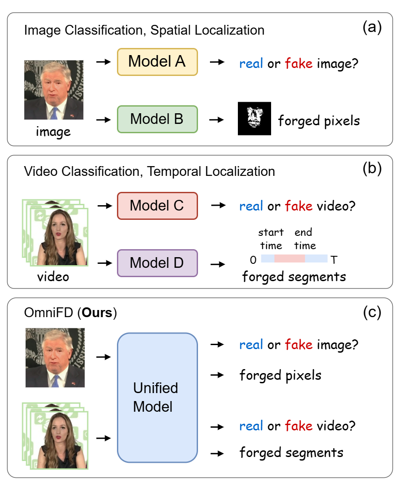

# OmniFD: A Unified Model for Versatile Face Forgery Detection

This repository is the official implementation of
paper: [OmniFD: A Unified Model for Versatile Face Forgery Detection](https://arxiv.org/abs/2512.01128)



## Environment

- python: 3.9
- pytorch: 2.0

```sh
conda create -n omnifd python=3.9
conda activate omnifd

pip install torch==2.0.0 torchvision==0.15.1 torchaudio==2.0.1
pip install -U openmim

cd OmniFD
pip install -r requirements.txt
pip install -e .
```

## Dataset Preparation

We perform experiments on the following datasets: [ForgeryNet](https://yinanhe.github.io/projects/forgerynet.html#), [FaceForensics++](https://github.com/ondyari/FaceForensics), [FMLD](https://github.com/ChenqiKONG/Detect_and_Locate?tab=readme-ov-file#fmld-dataset), [WildDeepfake](https://github.com/OpenTAI/wild-deepfake?tab=readme-ov-file#%EF%B8%8F-request-for-download), and [LAV-DF](https://github.com/ControlNet/LAV-DF). 

We use [RetinaFace](https://github.com/biubug6/Pytorch_Retinaface) to detect face bounding boxes from each video clip or static image when necessary.
We follow the same processing steps described in [DeepfakeBench](https://github.com/SCLBD/DeepfakeBench)
 for FaceForensics++ and other cross-domain datasets used in the paper. 

The processed annotation files are provided at this [link](https://drive.google.com/drive/folders/1auf-c_82SpKP0XfJlx9vJdcz7BiwLOy_?usp=sharing).

The dataset directory structure is as follows:

```
data/
├── ForgeryNet/
│   ├── annotations
│   ├── Training/
│   │   ├── image
│   │   ├── spatial_localize
│   │   └── video
│   └── Validation/
│       ├── image
│       ├── spatial_localize
│       └── video
├── FaceForensics++/
│   ├── annotations
│   ├── original_sequences
│   └── manipulated_sequences
├── FMLD/
│   ├── annotations
│   ├── faces
│   └── masks
├── WildDeepFake/
│   ├── annotations
│   ├── real_train
│   ├── real_test
│   ├── fake_train
│   └── fake_test
└── LAV-DF/
    ├── annotations
    ├── train
    └── test
```

## Training and Evaluation

Here is an example using OmniFD (Swin-S) on ForgeryNet for four tasks.

### Training

```shell
bash tools/dist_train.sh configs_omnifd/unified/omnifd_swin-s_50k_forgerynet.py 4
```

### Evaluation

```shell
CHECKPOINT=pretrained/omnifd_swin-s_50k_forgerynet.pth
bash tools/dist_test.sh configs_omnifd/single/omnifd_swin-s_50k_forgerynet_video.py    $CHECKPOINT 4
bash tools/dist_test.sh configs_omnifd/single/omnifd_swin-s_50k_forgerynet_temporal.py $CHECKPOINT 4
bash tools/dist_test.sh configs_omnifd/single/omnifd_swin-s_50k_forgerynet_image.py    $CHECKPOINT 4
bash tools/dist_test.sh configs_omnifd/single/omnifd_swin-s_50k_forgerynet_spatial.py  $CHECKPOINT 4
```

More configuration files can be found in ``configs_omnifd``.
The pretrained weights are available at
this [link](https://drive.google.com/drive/folders/1Bh8FbF-jiyPtgr7-URNuGAOJhi8kZSEC?usp=sharing).

## Acknowledgment

The code is largely based
on [MMPretrain](https://github.com/open-mmlab/mmpretrain), [MMAction2](https://github.com/open-mmlab/mmaction2), [MMSegmentation](https://github.com/open-mmlab/mmsegmentation),
and [OpenTAD](https://github.com/sming256/OpenTAD). Thanks for their contributions.

## Citation


If you find this repository useful in your research, please consider citing:


```latex
@misc{liu2025omnifd,
      title={OmniFD: A Unified Model for Versatile Face Forgery Detection}, 
      author={Haotian Liu and Haoyu Chen and Chenhui Pan and You Hu and Guoying Zhao and Xiaobai Li},
      year={2025},
      eprint={2512.01128},
      archivePrefix={arXiv},
}
```